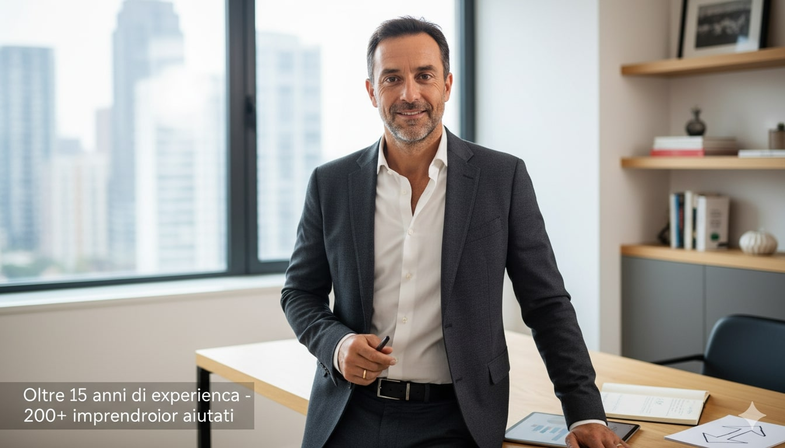

# Contenuti File Configurazione - Coach Website

## 📄 netlify.toml
```toml
[build]
  publish = "."

[[headers]]
  for = "/*"
  [headers.values]
    X-Frame-Options = "DENY"
    X-XSS-Protection = "1; mode=block"
    X-Content-Type-Options = "nosniff"
    Referrer-Policy = "strict-origin-when-cross-origin"

[[headers]]
  for = "*.css"
  [headers.values]
    Cache-Control = "public, max-age=31536000, immutable"

[[headers]]
  for = "*.js"
  [headers.values]
    Cache-Control = "public, max-age=31536000, immutable"

[[headers]]
  for = "*.jpg"
  [headers.values]
    Cache-Control = "public, max-age=31536000, immutable"

[[headers]]
  for = "*.png"
  [headers.values]
    Cache-Control = "public, max-age=31536000, immutable"

[[headers]]
  for = "*.webp"
  [headers.values]
    Cache-Control = "public, max-age=31536000, immutable"
```

## 📄 _redirects
```
# Single Page Application routing
/*    /index.html   200
```

## 📄 .gitignore
```
# Netlify
.netlify

# Logs
logs
*.log
npm-debug.log*
yarn-debug.log*
yarn-error.log*

# Runtime data
pids
*.pid
*.seed
*.pid.lock

# Coverage directory used by tools like istanbul
coverage/

# nyc test coverage
.nyc_output

# Dependency directories
node_modules/

# Optional npm cache directory
.npm

# Optional REPL history
.node_repl_history

# Output of 'npm pack'
*.tgz

# Yarn Integrity file
.yarn-integrity

# dotenv environment variables file
.env

# IDE files
.vscode/
.idea/
*.swp
*.swo
*~

# OS generated files
.DS_Store
.DS_Store?
._*
.Spotlight-V100
.Trashes
ehthumbs.db
Thumbs.db
```

```html
<!DOCTYPE html>
<html lang="it">
<head>
    <meta charset="UTF-8">
    <meta name="viewport" content="width=device-width, initial-scale=1.0">
    <meta name="description" content="Business Coach professionale - Trasforma la tua attività con strategie comprovate">
    <title>Marco Rossi - Business Coach | Trasforma il Tuo Business</title>
    
    <!-- Preconnect to Google Fonts -->
    <link rel="preconnect" href="https://fonts.googleapis.com">
    <link rel="preconnect" href="https://fonts.gstatic.com" crossorigin>
    
    <!-- Google Fonts -->
    <link href="https://fonts.googleapis.com/css2?family=Playfair+Display:wght@400;700;900&family=Inter:wght@300;400;500;600;700&display=swap" rel="stylesheet">
    
    <!-- CSS -->
    <link rel="stylesheet" href="css/style.css">
    
    <!-- Favicon -->
    <link rel="icon" type="image/x-icon" href="images/favicon.ico">
    
    <!-- Open Graph Meta Tags -->
    <meta property="og:title" content="Marco Rossi - Business Coach">
    <meta property="og:description" content="Trasforma la tua attività con strategie di business comprovate">
    <meta property="og:image" content="images/og-image.jpg">
    <meta property="og:url" content="https://marcorossicoach.com">
    <meta property="og:type" content="website">
    
    <!-- Twitter Card Meta Tags -->
    <meta name="twitter:card" content="summary_large_image">
    <meta name="twitter:title" content="Marco Rossi - Business Coach">
    <meta name="twitter:description" content="Trasforma la tua attività con strategie di business comprovate">
    <meta name="twitter:image" content="images/og-image.jpg">
</head>
<body>
    <!-- Header Navigation -->
    <header class="header">
        <nav class="nav">
            <div class="nav-container">
                <div class="nav-logo">
                    <a href="#home">Marco Rossi</a>
                </div>
                <ul class="nav-menu">
                    <li class="nav-item">
                        <a href="#home" class="nav-link">Home</a>
                    </li>
                    <li class="nav-item">
                        <a href="#about" class="nav-link">Chi Sono</a>
                    </li>
                    <li class="nav-item">
                        <a href="#services" class="nav-link">Servizi</a>
                    </li>
                    <li class="nav-item">
                        <a href="#testimonials" class="nav-link">Testimonianze</a>
                    </li>
                    <li class="nav-item">
                        <a href="#contact" class="nav-link">Contatti</a>
                    </li>
                </ul>
                <div class="nav-toggle">
                    <span class="bar"></span>
                    <span class="bar"></span>
                    <span class="bar"></span>
                </div>
            </div>
        </nav>
    </header>

    <main>
        <!-- Hero Section -->
        <section id="home" class="hero">
            <div class="hero-container">
                <div class="hero-content">
                    <h1 class="hero-title">
                        Trasforma il Tuo Business
                        <span class="hero-accent">Oggi</span>
                    </h1>
                    <p class="hero-subtitle">
                        Strategie comprovate per imprenditori che vogliono crescere, 
                        scalare e raggiungere risultati straordinari
                    </p>
                    <div class="hero-cta">
                        <a href="#contact" class="btn btn-primary">
                            Prenota una Consulenza
                        </a>
                        <a href="#services" class="btn btn-secondary">
                            Scopri i Servizi
                        </a>
                    </div>
                </div>
                <div class="hero-image">
                    
                </div>
            </div>
        </section>

        <!-- About Section -->
        <section id="about" class="about">
            <div class="container">
                <div class="section-header">
                    <h2 class="section-title">Chi Sono</h2>
                    <p class="section-subtitle">La mia passione è aiutare imprenditori come te a raggiungere il successo</p>
                </div>
                <div class="about-content">
                    <div class="about-text">
                        <p>
                            Con oltre 15 anni di esperienza nel business consulting, ho aiutato 
                            più di 200 imprenditori a trasformare le loro attività e raggiungere 
                            obiettivi che sembravano impossibili.
                        </p>
                        <p>
                            Il mio approccio è diretto, pratico e focalizzato sui risultati. 
                            Niente teoria astratta, solo strategie concrete che funzionano nel mondo reale.
                        </p>
                        <div class="about-stats">
                            <div class="stat">
                                <h3 class="stat-number">200+</h3>
                                <p class="stat-label">Clienti Soddisfatti</p>
                            </div>
                            <div class="stat">
                                <h3 class="stat-number">15+</h3>
                                <p class="stat-label">Anni di Esperienza</p>
                            </div>
                            <div class="stat">
                                <h3 class="stat-number">300%</h3>
                                <p class="stat-label">Crescita Media Clienti</p>
                            </div>
                        </div>
                    </div>
                    <div class="about-image">
                        
                    </div>
                </div>
            </div>
        </section>

        <!-- Services Section -->
        <section id="services" class="services">
            <div class="container">
                <div class="section-header">
                    <h2 class="section-title">I Miei Servizi</h2>
                    <p class="section-subtitle">Soluzioni su misura per le tue esigenze di business</p>
                </div>
                <div class="services-grid">
                    <div class="service-card">
                        <div class="service-icon">
                            
                        </div>
                        <h3 class="service-title">Business Strategy</h3>
                        <p class="service-description">
                            Sviluppiamo insieme una strategia solida per far crescere il tuo business 
                            in modo sostenibile e profittevole.
                        </p>
                        <ul class="service-features">
                            <li>Analisi di mercato</li>
                            <li>Pianificazione strategica</li>
                            <li>Definizione obiettivi</li>
                        </ul>
                        <a href="#contact" class="service-cta">Scopri di più</a>
                    </div>
                    
                    <div class="service-card">
                        <div class="service-icon">
                            
                        </div>
                        <h3 class="service-title">Business Growth</h3>
                        <p class="service-description">
                            Strategie concrete per aumentare le tue vendite, espandere il mercato 
                            e migliorare la redditività.
                        </p>
                        <ul class="service-features">
                            <li>Ottimizzazione processi</li>
                            <li>Strategie di marketing</li>
                            <li>Scaling operations</li>
                        </ul>
                        <a href="#contact" class="service-cta">Scopri di più</a>
                    </div>
                    
                    <div class="service-card">
                        <div class="service-icon">
                            
                        </div>
                        <h3 class="service-title">Mindset Coaching</h3>
                        <p class="service-description">
                            Sviluppa la mentalità da imprenditore di successo e supera le barriere 
                            che ti impediscono di raggiungere il pieno potenziale.
                        </p>
                        <ul class="service-features">
                            <li>Leadership skills</li>
                            <li>Gestione dello stress</li>
                            <li>Decision making</li>
                        </ul>
                        <a href="#contact" class="service-cta">Scopri di più</a>
                    </div>
                </div>
            </div>
        </section>

        <!-- Testimonials Section -->
        <section id="testimonials" class="testimonials">
            <div class="container">
                <div class="section-header">
                    <h2 class="section-title">Cosa Dicono i Miei Clienti</h2>
                    <p class="section-subtitle">Le storie di successo di chi ha già trasformato il proprio business</p>
                </div>
                <div class="testimonials-carousel">
                    <div class="testimonial active">
                        <div class="testimonial-content">
                            <p class="testimonial-text">
                                "Grazie a Marco, la mia azienda è cresciuta del 300% in solo 6 mesi. 
                                Le sue strategie sono pratiche, efficaci e immediatamente applicabili."
                            </p>
                            <div class="testimonial-author">
                                
                                <div class="author-info">
                                    <h4 class="author-name">Laura Bianchi</h4>
                                    <p class="author-title">CEO, Bianchi Fashion</p>
                                </div>
                            </div>
                        </div>
                    </div>
                    
                    <div class="testimonial">
                        <div class="testimonial-content">
                            <p class="testimonial-text">
                                "Marco mi ha aiutato a trasformare la mia piccola attività in un'azienda 
                                che fattura oltre 1 milione di euro. Il suo approccio diretto e senza fronzoli 
                                è esattamente ciò di cui avevo bisogno."
                            </p>
                            <div class="testimonial-author">
                                
                                <div class="author-info">
                                    <h4 class="author-name">Giuseppe Verdi</h4>
                                    <p class="author-title">Founder, Verdi Tech</p>
                                </div>
                            </div>
                        </div>
                    </div>
                    
                    <div class="testimonial">
                        <div class="testimonial-content">
                            <p class="testimonial-text">
                                "Dopo aver lavorato con Marco, ho finalmente la chiarezza e le strategie 
                                per portare il mio business al livello successivo. Investimento che si è 
                                ripagato 10 volte."
                            </p>
                            <div class="testimonial-author">
                                
                                <div class="author-info">
                                    <h4 class="author-name">Anna Neri</h4>
                                    <p class="author-title">Director, Neri Consulting</p>
                                </div>
                            </div>
                        </div>
                    </div>
                </div>
                <div class="testimonials-nav">
                    <button class="testimonial-nav-btn active" data-testimonial="0"></button>
                    <button class="testimonial-nav-btn" data-testimonial="1"></button>
                    <button class="testimonial-nav-btn" data-testimonial="2"></button>
                </div>
            </div>
        </section>

        <!-- Contact Section -->
        <section id="contact" class="contact">
            <div class="container">
                <div class="section-header">
                    <h2 class="section-title">Iniziamo Insieme</h2>
                    <p class="section-subtitle">Prenota una consulenza gratuita e scopri come posso aiutarti</p>
                </div>
                <div class="contact-content">
                    <div class="contact-info">
                        <h3>Pronto a Trasformare il Tuo Business?</h3>
                        <p>
                            La prima consulenza è completamente gratuita e senza impegno. 
                            Analizzeremo insieme la tua situazione e ti fornirò strategie concrete 
                            che potrai applicare immediatamente.
                        </p>
                        <div class="contact-details">
                            <div class="contact-item">
                                <div class="contact-icon">
                                    
                                </div>
                                <div class="contact-text">
                                    <h4>Email</h4>
                                    <p>marco@marcorossicoach.com</p>
                                </div>
                            </div>
                            <div class="contact-item">
                                <div class="contact-icon">
                                    
                                </div>
                                <div class="contact-text">
                                    <h4>Telefono</h4>
                                    <p>+39 333 1234567</p>
                                </div>
                            </div>
                            <div class="contact-item">
                                <div class="contact-icon">
                                    
                                </div>
                                <div class="contact-text">
                                    <h4>Sede</h4>
                                    <p>Milano, Italia</p>
                                </div>
                            </div>
                        </div>
                    </div>
                    <div class="contact-form">
                        <form id="consultation-form">
                            <div class="form-group">
                                <label for="name">Nome Completo</label>
                                <input type="text" id="name" name="name" required>
                            </div>
                            <div class="form-group">
                                <label for="email">Email</label>
                                <input type="email" id="email" name="email" required>
                            </div>
                            <div class="form-group">
                                <label for="phone">Telefono</label>
                                <input type="tel" id="phone" name="phone" required>
                            </div>
                            <div class="form-group">
                                <label for="business">Nome Attività</label>
                                <input type="text" id="business" name="business" required>
                            </div>
                            <div class="form-group">
                                <label for="message">Messaggio</label>
                                <textarea id="message" name="message" rows="4" required></textarea>
                            </div>
                            <button type="submit" class="btn btn-primary btn-full">
                                Prenota Consulenza Gratuita
                            </button>
                        </form>
                    </div>
                </div>
            </div>
        </section>
    </main>

    <!-- Footer -->
    <footer class="footer">
        <div class="container">
            <div class="footer-content">
                <div class="footer-brand">
                    <h3>Marco Rossi</h3>
                    <p>Business Coach & Strategist</p>
                    <div class="social-links">
                        <a href="#" aria-label="LinkedIn">
                            
                        </a>
                        <a href="#" aria-label="Instagram">
                            
                        </a>
                        <a href="#" aria-label="Facebook">
                            
                        </a>
                    </div>
                </div>
                <div class="footer-links">
                    <h4>Link Utili</h4>
                    <ul>
                        <li><a href="#about">Chi Sono</a></li>
                        <li><a href="#services">Servizi</a></li>
                        <li><a href="#testimonials">Testimonianze</a></li>
                        <li><a href="#contact">Contatti</a></li>
                    </ul>
                </div>
                <div class="footer-contact">
                    <h4>Contatti</h4>
                    <p>Email: marco@marcorossicoach.com</p>
                    <p>Telefono: +39 333 1234567</p>
                    <p>Sede: Milano, Italia</p>
                </div>
            </div>
            <div class="footer-bottom">
                <p>&copy; 2025 Marco Rossi - Business Coach. Tutti i diritti riservati.</p>
                <p>
                    <a href="#privacy">Privacy Policy</a> | 
                    <a href="#terms">Termini e Condizioni</a>
                </p>
            </div>
        </div>
    </footer>

    <!-- Success Modal -->
    <div id="success-modal" class="modal">
        <div class="modal-content">
            <span class="close-modal">&times;</span>
            <div class="modal-icon">
                
            </div>
            <h3>Richiesta Inviata con Successo!</h3>
            <p>Grazie per aver richiesto una consulenza. Ti contatterò entro 24 ore per fissare un appuntamento.</p>
            <button class="btn btn-primary modal-close">OK</button>
        </div>
    </div>

    <!-- JavaScript -->
    <script src="js/script.js"></script>
</body>
</html>
```

---

*Creato: 7 Ottobre 2025*
*Progetto: Coach Website - FASE 3*
*Scopo: Contenuti per file di configurazione*